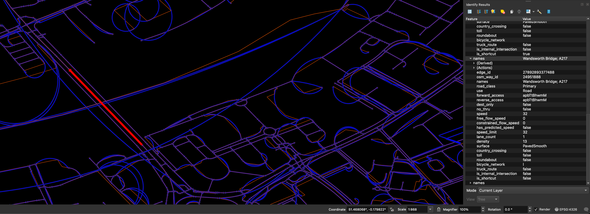

# Edge Exporter

This tool exports data from a Valhalla tile graph into [FlatGeobuf](https://flatgeobuf.org/).
This makes it easier to inspect a route graph using tools like [QGIS](https://qgis.org/).



## Building graph tiles

Build a graph the way you usually do (docker image etc.).
The Valhalla docs are your guide.
**This tool currently operates on the directory tree directly, not a tarball**.

## Exporting a FlatGeobuf

```shell
cargo run --profile release -- /path/to/valhalla/tiles /path/to/valhalla.fgb
```

Some numbers for context using the UK in December 2025 run on an M1 Max:

* Original OSM PBF size: 2GB
* Valhalla tiles directory (uncompressed): 2.66GB
* FlatGeobuf: 10.2GB (11.4GB with tippecanoe properties)
* Time to export: ~2 minutes
